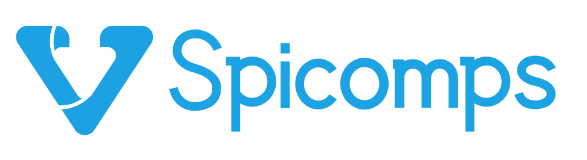

<p align="center">
  
</p>

<p align="center">一个特别的 Vue3 组件库（开发中）</p>

## 项目描述

该组件库是一个 Vue3 组件库，他不是为了替代市面上流行的 UI 组件库，而是一个互补的组件库，用于填补某些场景下，会有特殊的需求，如：下拉搜索、下拉筛选、表格枚举翻译等。

我对他的期望，在于为大家提供一些特殊的组件，或者是某些思路，大家可以直接使用该组件库进行开发，也可以从中获得灵感，自行封装

由于他是一个互补的组件库，所以一些基础组件，只会为了特殊组件去开发，以减少不必要的代码

## 快速开始

### 安装

```
# 选择一个你喜欢的包管理器

# NPM
$ npm install spicomps --save

# Yarn
$ yarn add spicomps

# pnpm
$ pnpm install spicomps
```

### 完整引入

```js
// main.ts
import { createApp } from 'vue'
import Spicomps from 'spicomps'
import 'spicomps/dist/index.css'
import App from './App.vue'

const app = createApp(App)

app.use(Spicomps)
app.mount('#app')
```

### 按需引入

```js
// spicomps.js

// 样式全部引入：import 'spicomps/dist/index.css'
// 按需引入
import 'spicomps/es/base-components/base/style/css.mjs'
import 'spicomps/es/base-components/button/style/css.mjs'
import 'spicomps/es/base-components/popover/style/css.mjs'
// 组件引入
import { SpButton, SpPopover } from 'spicomps'
const components = [SpPopover, SpButton]
export default {
  install(app) {
    components.forEach((item) => {
      app.use(item)
    })
  },
}
```

## 期望组件

1. 复合下拉组件，支持下拉搜索、筛选、分页
2. 卡片式单选框
3. 图片裁剪组件，支持固定尺寸、圆形裁剪、自定义路径裁剪
4. 表格枚举翻译，通过传入 option（label、value、color、icon），自动完成翻译工作，支持颜色、icon 显示等
5. 文本省略组件，支持省略位置（头部、尾部、中间），支持插槽 

hooks

1. 路径参数获取 hook，传入要获取的配置项，提供生命周期函数回调
